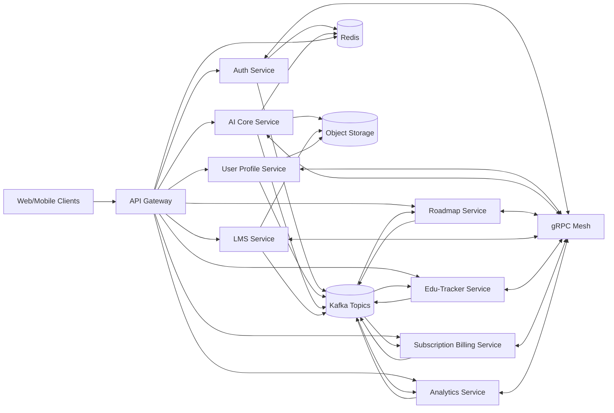

# System Architecture

## Context
CareerOS is a modular platform combining AI-HR consult, personalized roadmap generation, LMS, edu-tracking, subscription billing, and B2B tenant support.

## High-Level Topology

## Architectural Principles
- Bounded contexts map 1:1 to services.
- Every service owns its data and schema lifecycle.
- Domain events are immutable and versioned.
- Sync calls are minimized and bounded with timeouts/circuit breakers.
- AI outputs are schema-validated before persistence or downstream publishing.

## API Strategy
- North-south: REST/JSON through API gateway.
- East-west: gRPC with protobuf contracts in `contracts/grpc`.
- Async: Kafka topics using event envelope in `contracts/events/event-envelope-v1.json`.

## Multi-Tenant Strategy (B2B)
- Tenant-aware auth claims (`tenant_id`, `org_role`, `plan_tier`).
- Shared-db-per-service with strict row-level isolation initially.
- Upgrade path to schema-per-tenant or db-per-tenant for enterprise isolation.

## Reliability Defaults
- Idempotency key for write APIs and consumers.
- Outbox pattern for event publishing from each service DB.
- DLQ per topic with replay tooling.
- Saga orchestration for distributed workflows (subscription activation, premium entitlement, roadmap regen).

## Observability
- Correlation ID generated at gateway and propagated via gRPC metadata/event headers.
- OpenTelemetry traces across all services.
- Prometheus metrics: latency, throughput, error rate, consumer lag, AI token usage, per-tenant cost.
- Centralized logs to ELK/OpenSearch with PII redaction policies.
